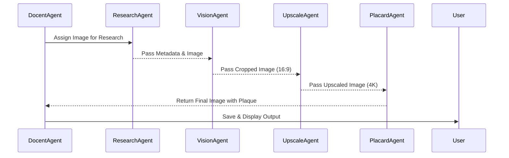

# AI Art Team Project: Implementation Plan

## Introduction
This document provides a detailed technical implementation plan for the AI Art Team project, translating the product design specifications into actionable instructions for the development team. The plan focuses on enhancing the existing system to support aspect ratio adjustments, upscaling to 4K resolution, and plaque integration while preserving artistic integrity. It includes a revised architecture, integration steps, timelines, milestones, and visual diagrams to guide the team towards a functional beta version.

## Current Architecture Overview
The existing system is a modular agent-based architecture orchestrated by the `DocentAgent`, which manages the workflow through queues and threading. Key components include:
- **DocentAgent**: Central orchestrator, dynamically assigning tasks to agents.
- **ResearchAgent**: Extracts metadata and contextual data from images.
- **VisionAgent Classes**: Genre-specific processing for intelligent cropping to 16:9 aspect ratio.
- **UpscaleAgent (Placeholder)**: Not implemented, intended for resolution enhancement.
- **PlacardAgent (Placeholder)**: Not implemented, intended for plaque overlay.

## Proposed Architecture Enhancements
To meet project requirements, the architecture will be extended with new components and workflow modifications.

### New Components
1. **UpscaleAgent**:
   - **Purpose**: Upscale cropped images to 4K resolution using ESRGAN.
   - **Location**: `art_agent_team/agents/upscale_agent.py`
   - **Dependencies**: Requires integration with deep learning libraries (e.g., TensorFlow or PyTorch) for ESRGAN implementation, and image processing libraries like PIL for handling input/output.
2. **PlacardAgent**:
   - **Purpose**: Design and overlay plaques with metadata on upscaled images.
   - **Location**: `art_agent_team/agents/placard_agent.py`
   - **Dependencies**: Requires PIL for text rendering and image overlay, and access to metadata from `ResearchAgent`.

### Workflow Modifications
- **DocentAgent Workflow Extension**: Update `start_workflow()` in `docent_agent.py` to include sequential processing steps post-`VisionAgent` cropping:
  1. Handoff cropped images to `UpscaleAgent` via a new `upscale_input_queue`.
  2. Handoff upscaled images to `PlacardAgent` via a new `placard_input_queue`.
  3. Save final outputs after plaque integration.
- **Queue Management**: Add thread-safe queues in `DocentAgent` for managing handoff between agents, ensuring no data loss during concurrent processing.
- **Configuration Updates**: Extend `config.yaml` to include parameters for upscaling (e.g., ESRGAN model path, sharpness settings) and plaque design (e.g., font, position, opacity).

### Architectural Diagram
Below is a Mermaid diagram illustrating the enhanced workflow architecture:

```mermaid
flowchart TD
    A[Input Images] --> B[DocentAgent]
    B --> C[ResearchAgent]
    C --> D[VisionAgent<br/>(Genre-Specific)]
    D --> E[UpscaleAgent]
    E --> F[PlacardAgent]
    F --> G[Final Output Images]
    B -->|Manages Workflow| H[Queues & Threads]
    H -->|Coordinates| C
    H -->|Coordinates| D
    H -->|Coordinates| E
    H -->|Coordinates| F
    subgraph Agent Workflow
        C ---|Metadata| D
        D ---|Cropped Image| E
        E ---|Upscaled Image| F
    end
```

This diagram shows the sequential processing from input to final output, with `DocentAgent` coordinating via queues and threads.

## Implementation Steps

### Phase 1: Development of New Agents (Weeks 1-4)
- **Task 1.1: Implement UpscaleAgent (Weeks 1-2)**
  - Develop `upscale_agent.py` to integrate ESRGAN for upscaling to 4K (3840x2160 pixels).
  - Focus on detail preservation (brush strokes, texture) by tuning ESRGAN parameters for texture and edge sharpness.
  - Implement artifact reduction filters targeting a PSNR of 30 dB.
  - Test processing time to ensure <30 seconds per image on standard hardware.
  - **Assigned To**: AI/ML Specialist
- **Task 1.2: Implement PlacardAgent (Weeks 3-4)**
  - Develop `placard_agent.py` to render plaques with textured white cardstock aesthetic, black sans-serif text (Helvetica/Arial), positioned in lower right corner with 2% margin.
  - Dynamically size plaque (20-30% image width) to fit metadata (Title, Artist, Nationality, Date) with minimum 12pt font at 4K resolution.
  - Use PIL for text rendering and overlay with 80% opacity background.
  - **Assigned To**: UI/Graphics Developer

### Phase 2: Workflow Integration (Weeks 5-6)
- **Task 2.1: Update DocentAgent (Week 5)**
  - Modify `docent_agent.py` to include new queues (`upscale_input_queue`, `placard_input_queue`) for handoff between agents.
  - Extend `start_workflow()` to process images through `UpscaleAgent` and `PlacardAgent` after `VisionAgent` cropping.
  - Ensure thread-safe operations with proper task completion signaling.
  - **Assigned To**: Backend Developer
- **Task 2.2: Configuration Enhancements (Week 6)**
  - Update `config.yaml` to include parameters for upscaling (model path, settings) and plaque design (font, position, opacity).
  - Allow user overrides via command-line arguments for flexibility.
  - **Assigned To**: Configuration Specialist

### Phase 3: Artistic Integrity Assurance (Weeks 7-8)
- **Task 3.1: Implement Validation Checks (Week 7)**
  - Add composition checks post-cropping (IoU > 0.9 for key elements) in `VisionAgent` classes.
  - Implement color fidelity checks post-upscaling (histogram correlation > 0.95) in `UpscaleAgent`.
  - Use `ResearchAgent` metadata for historical context in processing decisions.
  - **Assigned To**: Quality Assurance Engineer
- **Task 3.2: Develop Feedback Loop (Week 8)**
  - Integrate a lightweight CNN model for artistic fidelity scoring (target > 0.85) in `DocentAgent`, flagging images for review if below threshold.
  - Generate fidelity reports saved with final outputs.
  - **Assigned To**: AI/ML Specialist

### Phase 4: Testing and Refinement (Weeks 9-12)
- **Task 4.1: Unit and Integration Testing (Weeks 9-10)**
  - Test individual agents (`UpscaleAgent`, `PlacardAgent`) for functionality and performance.
  - Test full workflow integration in `DocentAgent` with batch processing of diverse artwork genres.
  - **Assigned To**: Testing Team
- **Task 4.2: Artistic Fidelity Testing (Weeks 11-12)**
  - Conduct manual and automated reviews of processed images against originals for composition, color, and emotional impact.
  - Iterate on agent parameters based on feedback to improve fidelity scores.
  - **Assigned To**: Art Critic Consultant & QA Team

## Timelines and Milestones
| Phase | Duration | Milestone | Completion Date |
|-------|----------|-----------|-----------------|
| Phase 1: Development of New Agents | Weeks 1-4 | `UpscaleAgent` and `PlacardAgent` implemented | End of Week 4 (May 27, 2025) |
| Phase 2: Workflow Integration | Weeks 5-6 | Workflow extended with new agents and configuration | End of Week 6 (June 10, 2025) |
| Phase 3: Artistic Integrity Assurance | Weeks 7-8 | Validation checks and feedback loop integrated | End of Week 8 (June 24, 2025) |
| Phase 4: Testing and Refinement | Weeks 9-12 | Functional beta version with validated artistic fidelity | End of Week 12 (July 22, 2025) |

## Component Interaction Diagram
Below is a Mermaid sequence diagram detailing the interaction between components during image processing:



This diagram illustrates the sequential handoff of processed images between agents, managed by `DocentAgent`.

## Technical Requirements
- **Libraries**: TensorFlow/PyTorch for ESRGAN in `UpscaleAgent`, PIL for image processing in `PlacardAgent` and other agents.
- **Hardware**: GPU with at least 8GB VRAM for efficient upscaling with ESRGAN.
- **Environment**: Python 3.8+ with dependencies listed in `requirements.txt`, updated to include new libraries.
- **Testing Tools**: Unit testing with `pytest`, integration testing scripts in `art_agent_team/tests/`.

## Potential Challenges and Mitigations
- **Challenge 1: ESRGAN Performance**: Upscaling with ESRGAN may exceed 30-second target per image on standard hardware.
  - **Mitigation**: Optimize model by reducing layers or using pre-trained weights; offer CPU fallback with longer processing times.
- **Challenge 2: Plaque Readability**: Dynamic sizing of plaques may result in text too small for readability at 4K.
  - **Mitigation**: Implement minimum font size constraints and allow user overrides for plaque dimensions.
- **Challenge 3: Artistic Fidelity Variability**: Fidelity scoring may vary across genres, leading to inconsistent flagging.
  - **Mitigation**: Train CNN on diverse artwork dataset and adjust thresholds per genre based on testing feedback.

## Conclusion
This implementation plan provides a structured roadmap for the AI Art Team project to achieve a functional beta version by July 22, 2025. By developing new agents (`UpscaleAgent`, `PlacardAgent`), extending the `DocentAgent` workflow, and ensuring artistic integrity through validation checks, the team will deliver a system that processes artwork images with high fidelity to user requirements. The next step is to assign tasks to team members and initiate development as per the outlined phases.
## LLM Constraints

### ResearchAgent
- Vision Models: Fixed as specified (OpenRouter, Gemini, Grok vision models)
- Consolidation/Communication Model: `grok-3-mini-fast-high-beta`

### VisionAgents
- Vision Analysis Model: `gemini-2.5-pro-exp-03-25`
- Communication/Reasoning Model: `grok-3-mini-fast-high-beta`

### PlacardAgent
- Communication/Reasoning Model: `grok-3-mini-fast-high-beta`

### DocentAgent
- Communication/Reasoning Model: `grok-3-mini-fast-high-beta`

### General
- 'Thinking' functionality uses `grok-3-mini-fast-high-beta` for internal reasoning/validation across relevant agents.