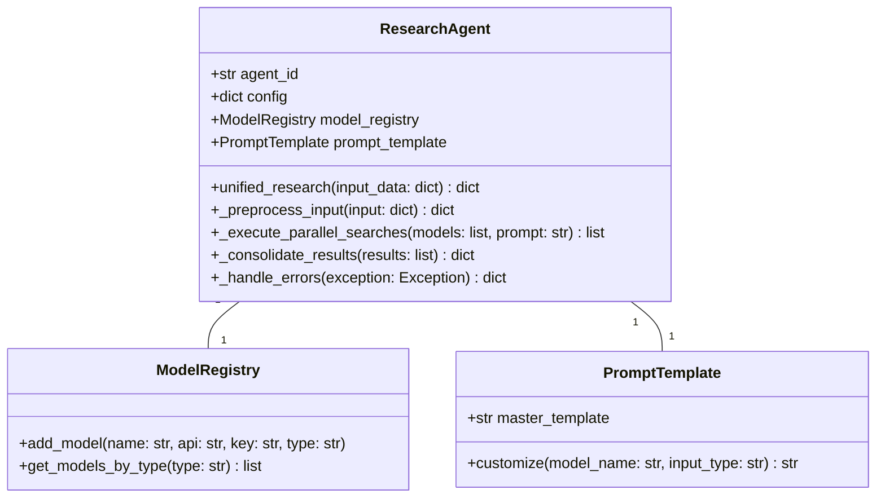
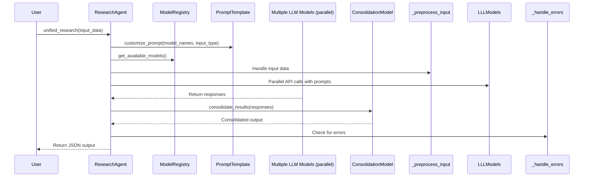
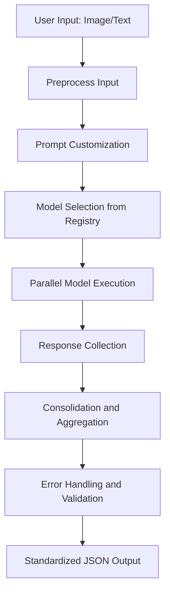

# Detailed Plan for Accomplishing the ResearchAgent Refactoring Task

## Introduction
This document provides a comprehensive plan for refactoring the ResearchAgent to implement a unified workflow, integrate new vision-capable LLM models, and enhance data flow and error handling. The plan is based on the analysis of current architecture and user requirements, ensuring a step-by-step approach for the development team. Diagrams are included using Mermaid syntax for clarity.

## Task Breakdown and Implementation Steps
1. **Preparation and Setup**:
   - Review existing code in research_agent.py to understand current workflows.
   - Update the model registry to include all specified models (e.g., OPENROUTER_INTERNVL, OPENROUTER_MISTRAL3) with dynamic configuration.

2. **Unified Workflow Development**:
   - Refactor the research_and_process method into a single unified_research method that handles both text and image inputs.
   - Implement parallel processing for multi-model calls using Python's concurrent.futures for efficiency.

3. **Model Integration**:
   - Create a ModelRegistry class to manage models, API keys, and endpoints. Add methods to register and select models dynamically.
   - Ensure parallel calls to models, collecting responses for consolidation.

4. **Data Flow Implementation**:
   - Input Handling: Parse inputs to extract filename tokens and image data.
   - Multi-Model Processing: Distribute prompts to models in parallel.
   - Consolidation: Use the consolidation model to aggregate results, resolving conflicts based on confidence scores.
   - Output: Format all outputs to standardized JSON with required fields.

5. **Structural Enhancements**:
   - Master Prompt Template: Develop a base template with inheritance or composition for model-specific customizations.
   - Artistic Movement Classification: Integrate predefined styles into prompt and consolidation logic.
   - Error Handling: Enhance with retries, fallbacks, and logging.

6. **Testing and Validation**:
   - Unit tests for individual components (e.g., prompt generation, model calls).
   - Integration tests for the unified workflow with sample inputs.
   - Performance testing for parallel processing and error scenarios.

7. **Deployment and Review**:
   - Integrate changes into the main codebase.
   - Conduct code reviews and user acceptance testing.

## Mermaid Diagrams
### Class Diagram for Refactored ResearchAgent

### Sequence Diagram for Unified Workflow

### Data Flow Diagram for Multi-Model Processing

## Interface Definitions
- **unified_research(input_data: dict) -> dict**: Entry point; input_data contains 'type' (text or image), 'data' (query or path), returns consolidated JSON.
- **ModelRegistry.add_model(name: str, api: str, key: str, type: str)**: Adds a model to the registry with vision/text type specification.
- **PromptTemplate.customize(model_name: str, input_type: str) -> str**: Generates a prompt based on model and input type.
- **consolidate_results(results: list) -> dict**: Takes a list of model responses and returns a single consolidated dictionary.

## Error Handling Strategy Document
- **Strategy Overview**: Implement a layered error handling approach to ensure reliability.
  - **Input Layer**: Validate inputs early; raise exceptions for unsupported formats or missing data.
  - **API Layer**: Use retries (3 attempts with exponential backoff) for API calls; fallback to alternative models if one fails (e.g., use GROK if GEMINI fails).
  - **Processing Layer**: Handle parsing errors in responses; ensure default JSON structure is returned.
  - **Consolidation Layer**: If consolidation fails, return a safe default output with low confidence.
  - **Global Fallback**: If all models fail, use a cached or static response if available, or return an error state.
- **Monitoring and Logging**: Log all errors with timestamps and context; integrate with existing logging for traceability.
- **Testing**: Include fault injection tests to simulate failures and verify fallback mechanisms.

This plan provides a clear roadmap for the team to implement the refactoring, ensuring alignment with project goals and minimizing risks.