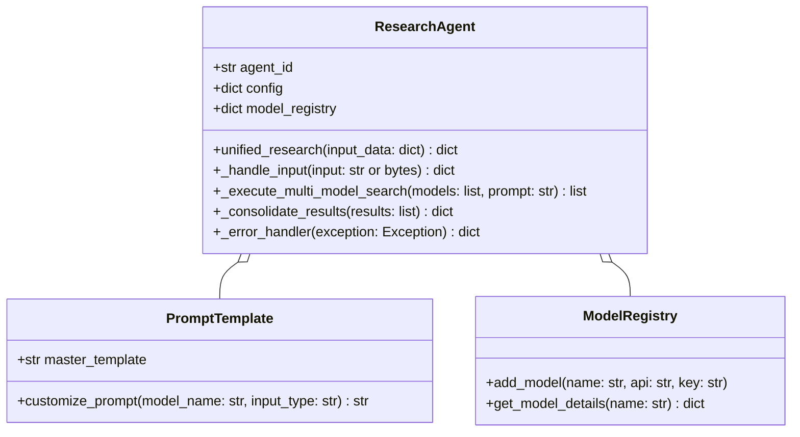
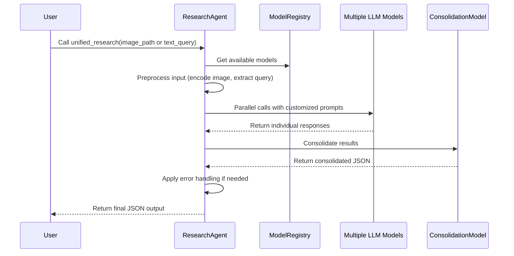
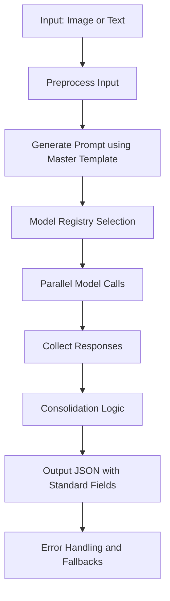

# Product Design Plan: ResearchAgent Refactoring

## Introduction
This product design plan outlines the architectural blueprint for refactoring the ResearchAgent to meet the specified requirements. It focuses on designing a unified, efficient, and scalable system for text and image processing in artwork research, incorporating new vision-capable LLM models and enhanced data handling.

## High-Level Design
- **Unified Workflow Component**: A single entry point method (e.g., unified_research) will handle both text and image inputs, eliminating separate text-only functions. This method will orchestrate input handling, multi-model processing, data consolidation, and output formatting.
- **Model Registry**: Implement a dynamic registry (e.g., a dictionary or configuration class) to store model details, including names, API endpoints, and keys. This allows easy addition of new models like OPENROUTER_INTERNVL and OPENROUTER_MISTRAL3, with parallel execution using threading or async calls.
- **Data Flow Design**: 
  - **Input Handling**: Accept filename tokens and image data, preprocess to extract queries and encode images.
  - **Multi-Model Processing**: Distribute queries to multiple models in parallel, collecting responses.
  - **Data Consolidation**: Use a consolidation model (e.g., CONSOLIDATION_MODEL) to aggregate results, resolving conflicts and ensuring consistency.
  - **Output Formatting**: Standardize output to JSON with required fields, ensuring all data is formatted correctly.

## Key Structures
- **Master Prompt Template System**: A central template with placeholders for dynamic insertion of model-specific instructions or content types (text/image).
- **Model-Specific Prompt Customization**: Adapt the master template based on model capabilities, e.g., adding vision-specific directives for multimodal models.
- **Artistic Movement Classification Integration**: Integrate predefined styles into the prompt and consolidation logic to ensure accurate classification.
- **Error Handling and Fallback Strategies**: Define strategies including retry mechanisms, model fallbacks (e.g., switch to a default model if one fails), and input validation to handle exceptions gracefully.

## Mermaid Diagrams
### Class Diagram for Refactored ResearchAgent

### Sequence Diagram for Unified Workflow

### Data Flow Diagram for Multi-Model Processing

## Interface Definitions
- **unified_research(input_data: dict) -> dict**: Accepts a dictionary with keys like 'image_path' or 'text_query', returns consolidated JSON output.
- **add_model(name: str, api: str, key: str)**: Adds a new model to the registry.
- **customize_prompt(model_name: str, input_type: str) -> str**: Returns a prompt tailored to the model and input type.
- **consolidate_results(results: list) -> dict**: Aggregates results from multiple models into a single standardized output.

## Error Handling Strategy
- **Validation Errors**: Check for invalid inputs (e.g., unsupported file formats) and raise exceptions early.
- **API Failures**: Implement retries (up to 3 attempts) with exponential backoff; fallback to alternative models if one fails.
- **Response Parsing**: Ensure JSON parsing handles malformed responses, defaulting to error states.
- **Fallback Mechanisms**: If all models fail, return a default JSON with low confidence and error message.
- **Logging**: Log all errors with context for debugging, using the existing logging setup.

This design ensures a robust, maintainable system aligned with project requirements.
## LLM Constraints

### ResearchAgent
- Vision Models: 
 - Vision Models to be called through the OpenRouter API using OpenRouter API Key
OPENROUTER_LLAMA_MAVERICK = "meta-llama/llama-4-maverick:free"
OPENROUTER_LLAMA_SCOUT = "meta-llama/llama-4-scout:free"
OPENROUTER_QWEN_VL = "qwen/qwen2.5-vl-72b-instruct:free"
OPENROUTER_INTERNVL = "opengvlab/internvl3-14b:free"
OPENROUTER_MISTRAL3 = "mistralai/mistral-small-3.1-24b-instruct:free"
OPENROUTER_GEMMA3 = "google/gemma-3-27b-it:free"
 - Vision Models to be called through the Google Gemini API using Gemini API Key, or Google Vertex AI API using Vertex AI project credentials
GEMINI_IMAGE_SEARCH_MODEL = "gemini-2.5-pro-exp-03-25"
FLASH_IMAGE_SEARCH_MODEL = "gemini-2.0-flash-exp"
 - Vision Models to be called through the Grok OpenAI-compatible API using Grok API Key
GROK_IMAGE_SEARCH_MODEL = "grok-2-vision-1212"
 - Consolidation Model to be called through the Grok OpenAI-compatible API using Grok API Key
CONSOLIDATION_MODEL = "grok-3-mini-fast-high-beta"
- Consolidation/Communication Model: `grok-3-mini-fast-high-beta`

### VisionAgents
- Vision Analysis Model: `gemini-2.5-pro-exp-03-25`
- Communication/Reasoning Model: `grok-3-mini-fast-high-beta`

### PlacardAgent
- Communication/Reasoning Model: `grok-3-mini-fast-high-beta`

### DocentAgent
- Communication/Reasoning Model: `grok-3-mini-fast-high-beta`

### General
- 'Thinking' functionality uses `grok-3-mini-fast-high-beta` for internal reasoning/validation across relevant agents.